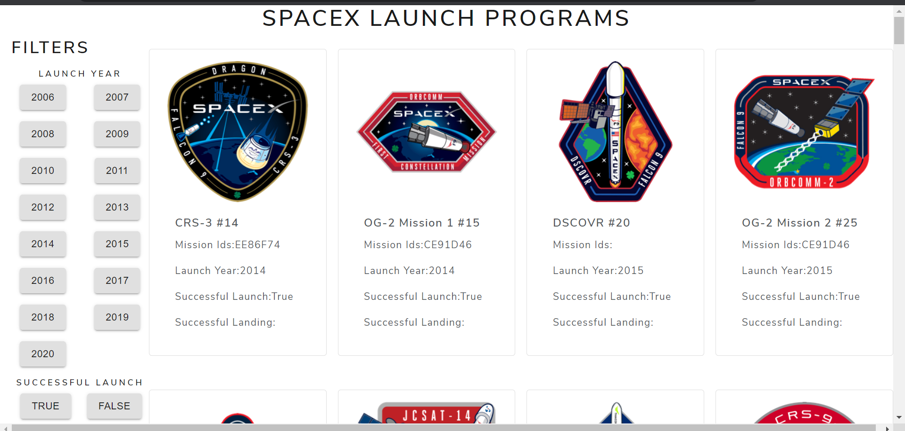
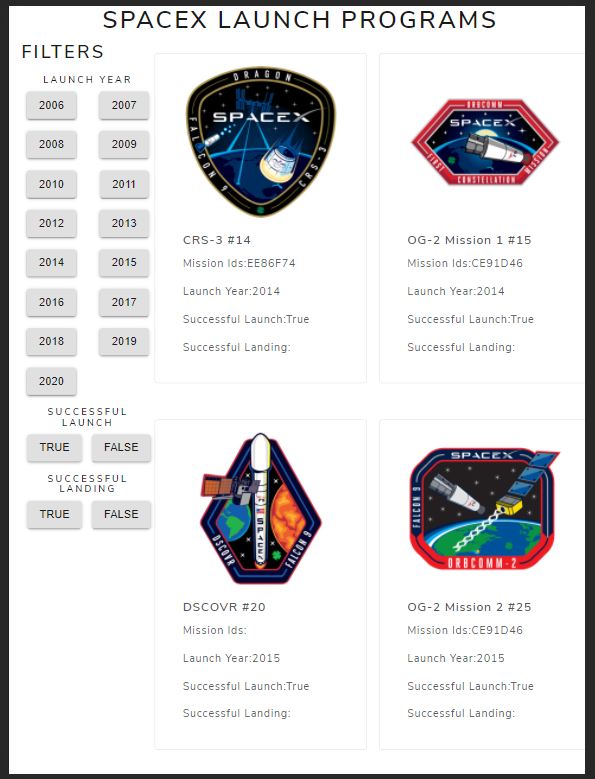
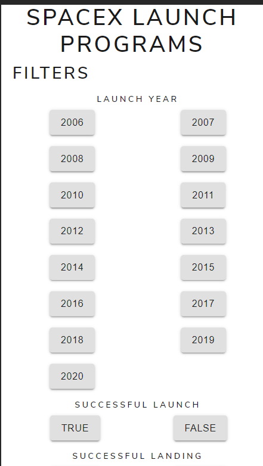
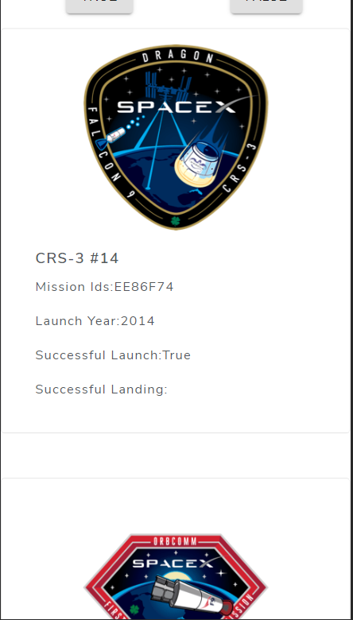

<h3>Tech dome assignment </h3>

 Desktop view 

Tablet View

Mobile View

Mobile View

The webpage consist of information about all the launches made by SpaceX company

It has Three filter for navigation
<ul>
  <li>Filter based on sucsessfull Launch which redirects to route `/year/:yearvalue`</li>
  <li>Filter based on successfull Landing which redirects to route `/launch/:launchValue`</li>
  <li>Filter based on Date which redirects to route `/land/:landvalue`</li>
</ul>
In above Route yearvalue denotes the value of the year launchValue and landValue denotes success or Failure respectively 

Pages

<ul>
  <li>Landing page:
 </li>
  <li>Filter based on Date:
</li>
  <li>Filter based on Launch success:
</li>
  <li>
   Filter based on Land success:
  </li>
  
</ul>
