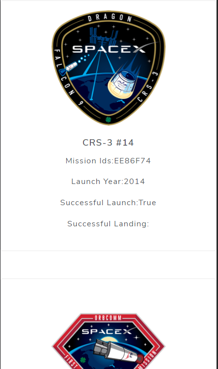

# Techdome Assignment
The website is made Using Technologies Like `React`, `MATERIAL UI` and data is fetched from API endpoint
### The webpage consist of information about all the launches made by `SpaceX company`

 Desktop view 

Tablet View

Mobile View

Mobile View

It has Three filter for navigation

 1. Filter based on  Date which redirects to route `year/:yearvalue`
 2. Filter based on successful Launch which redirects to route `/launch/:launchValue`
 3. Filter based on successful Landing which redirects to route `/land/:landvalue`

In above Route yearvalue denotes the value of the year launchValue and landValue denotes success or Failure respectively for a particular launch

Pages

  1. Landing page:
  
  
 
  2. Filter based on Date:
  
  

 3. Filter based on Launch success:
 
 

 
  4. Filter based on Land success:
  
  
  